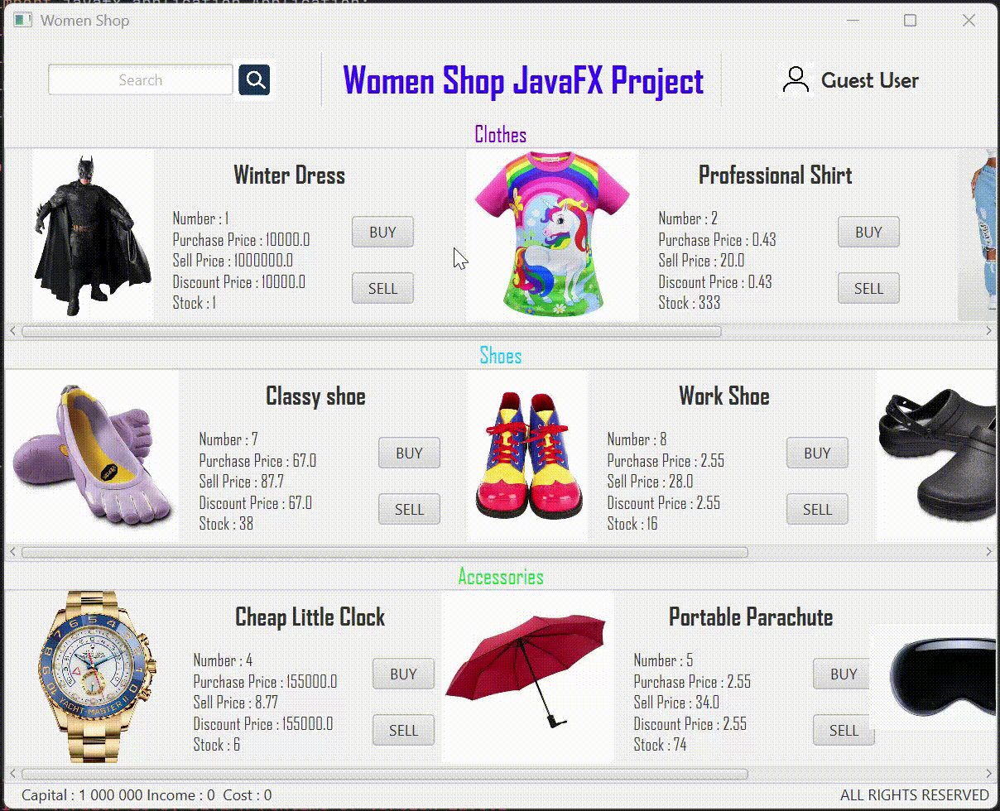

## Overview

> Java x Postgres clothes shop interface

This project is a simple clothes shop interface made with JavaFX and Postgres.



## Getting Started

- [Overview](#overview)
- [Getting Started](#getting-started)
  - [Documentation](#documentation)
  - [Setting up](#setting-up)
    - [Prerequisites](#prerequisites)
    - [Install](#install)
    - [Build \& Run](#build--run)
  - [Supported platforms](#supported-platforms)
  - [Supported languages](#supported-languages)
  - [Future improvements](#future-improvements)
  - [License](#license)

### Documentation

Find [here](./docs/STRUCTURE.md) the structure of the project.

### Setting up

#### Prerequisites

- JDK installed
- Gradle installed (8.10.1)
- git installed
- Docker & Docker Compose installed

#### Install

First clone the project:

```bash
git clone https://github.com/MorganKryze/Clothes-Shop.git
```

#### Build & Run

Go to the project directory:

```bash
cd Clothes-Shop/src/
```

Move to the database directory:

```bash
cd database/
```

Launch the postgres database:

```bash
docker-compose up -d
```

Move back to the project directory:

```bash
cd ../
```

Install the dependencies:

```bash
gradle build
```

Finally, run the project:

```bash
gradle run
```

### Supported platforms

- All JavaFX supported platforms.

### Supported languages

- English.

### Future improvements

- Add number selector.

### License

This project is licensed under the MIT License - see the [LICENSE.md](LICENSE) file for details.
