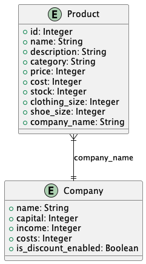

# Project structure

Here are the most important files and directories of the project:

```plaintext
Clothes-Shop
├── docs
│   ├── assets
│   │   └── img
│   │       └── ...
│   ├── architecture.puml
│   └── STRUCTURE.md
├── src
│   ├── app
│   │   └── src
│   │       └── ...
│   ├── database
│   │   ├── .env
│   │   ├── compose.yml
│   │   └── init.sql
│   └── project-code.sh
├── .gitignore
├── LICENCE
└── README.md
```

## `docs/`

This directory contains the documentation of the project including this very file, the architecture diagram of the database and the assets.



## `src/app`

This directory contains the source code for the JavaFX application.


## `src/database`

This directory contains the files needed to set up the postgres database.

### `java`

This directory contains the Java source code of the app:

- `org.example.controller`: Contains the controller for the JavaFX application.
- `org.example.model`: Contains the models (Company and Product).
- `org.example.repositories`: Contains the callable endpoint to query the database.
- `org.example`: Contains the starting point of the app.

### `resources`

This directory contains the fxml files for the JavaFX application and the css file for styling.

### `.env`

This file contains the environment variables needed to set up the database.

> [!WARNING]
> Do not update the variables in this file unless you update them in the JavaFX application. (See `src/app/src/main/java/org/example/repositories/...`)

### `compose.yml`

This file contains the configuration for the docker-compose service.

### `init.sql`

This file contains the SQL script to initialize the database.
